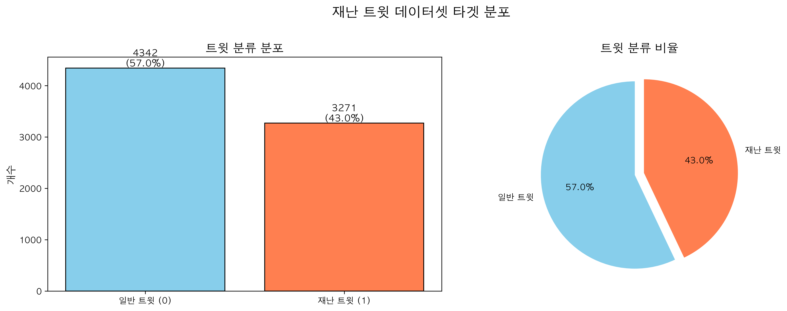
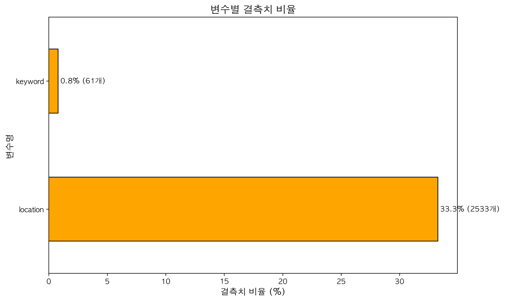
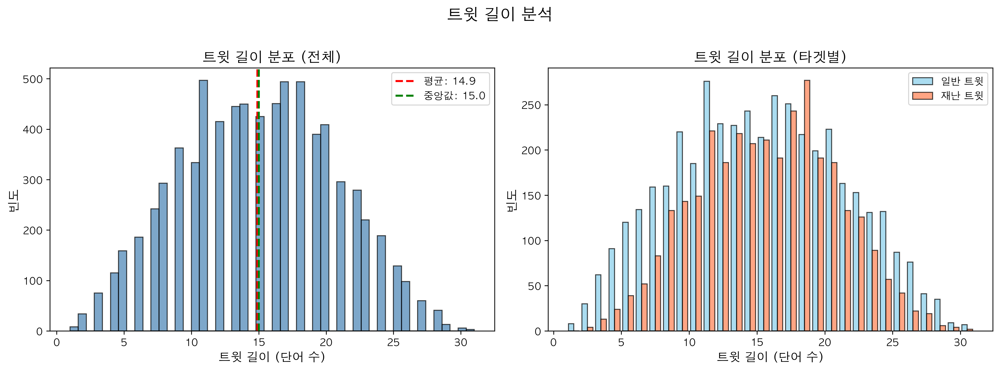
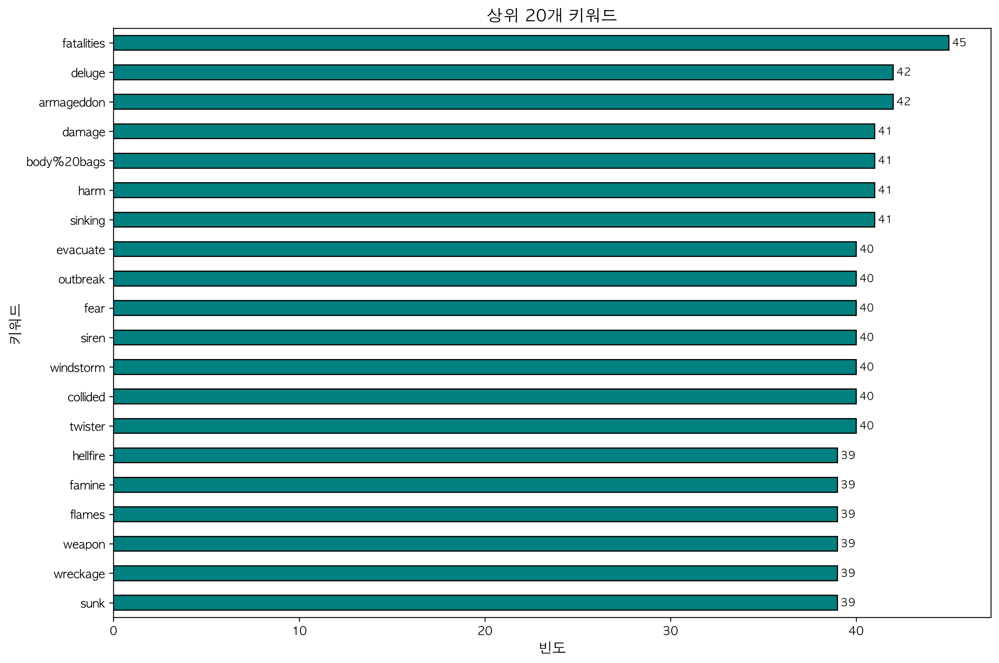
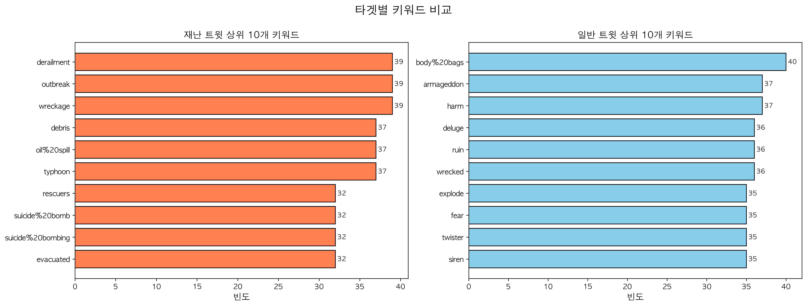
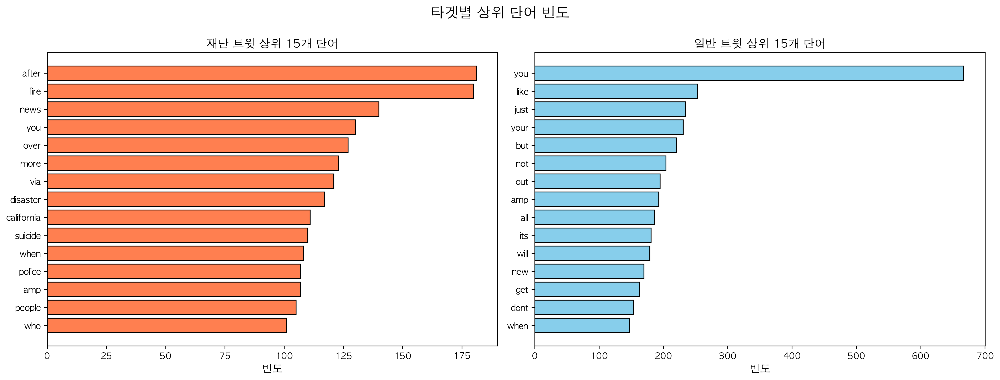

# Disaster Tweets: NLP 기반 재난 트윗 분류

**과제:** 트윗 텍스트 기반 실제 재난 여부 분류
**최고 점수:** 88.84% (검증 세트)
**방법론:** TF-IDF 기반 텍스트 벡터화 및 로지스틱 회귀
**모델:** Logistic Regression (GridSearchCV 최적화)

## 핵심 발견사항

### 주요 인사이트

NLP 기반 이진 분류에서 발견한 핵심 요인:

| 접근법          | 성능     | 특징                           |
| --------------- | -------- | ------------------------------ |
| **TF-IDF + LR** | 88.84%   | 단순하지만 강력한 baseline     |
| **Word2Vec + LSTM** | 57.39%   | 딥러닝 모델의 학습 부족        |


*그림: 학습 데이터의 타겟 분포 - 재난(1)과 비재난(0) 균형*

### 비즈니스 가설 검증

- TF-IDF 벡터화가 짧은 텍스트(트윗)에서 효과적
- 전통적 ML 모델이 소규모 텍스트 데이터에서 딥러닝보다 우수
- 키워드와 위치 정보보다 텍스트 내용이 더 중요
- 불용어 제거와 텍스트 정제가 성능 향상에 기여

---

## 분석 파이프라인

### 0. 문제 정의

- **목표:** 이진 분류 (재난/비재난)
- **데이터셋:** 훈련 샘플 7,613개, 테스트 샘플 3,263개
- **평가 지표:** 정확도
- **접근 방식:** 텍스트 전처리 → 벡터화 → 모델 선택 → 하이퍼파라미터 튜닝

### 1. 데이터 탐색 주요 내용

**데이터셋 특성:**
- 3개 특징: text (트윗 본문), keyword (키워드), location (위치)
- 목표 변수 분포: 43% 재난, 57% 비재난 (비교적 균형)
- 텍스트 길이: 평균 약 15단어, 최대 약 35단어

**특징 관찰:**
- text: 결측 없음 (주요 예측 변수)
- keyword: 0.8% 결측 (최빈값으로 대체)
- location: 33.3% 결측 (분석에서 제외)


*그림: 데이터셋의 결측치 분포*


*그림: 재난/비재난 트윗의 길이 분포 비교*

### 2. 텍스트 전처리 및 특징 공학

**전처리 파이프라인:**

| 단계              | 방법                          | 목적                    |
| ----------------- | ----------------------------- | ----------------------- |
| 소문자 변환       | `.lower()`                    | 대소문자 통일           |
| 특수문자 제거     | 정규식 `[^a-z ]`              | 노이즈 제거             |
| 토큰화            | NLTK `word_tokenize`          | 단어 단위 분리          |
| 불용어 제거       | NLTK stopwords                | 의미 없는 단어 제거     |
| 벡터화            | TF-IDF                        | 수치 벡터 변환          |


*그림: 주요 키워드 분포*


*그림: 재난/비재난 트윗의 키워드 차이*

**특징 공학 전략:**
- TF-IDF를 사용하여 단어의 중요도를 반영한 벡터 생성
- 희소 행렬 형태로 효율적인 메모리 사용
- 단어 빈도와 역문서 빈도를 동시에 고려


*그림: 재난/비재난 트윗의 주요 단어 빈도*

### 3. 모델 선택 및 결과

**테스트된 후보 모델:**
- 로지스틱 회귀 (Baseline): 79.65% 정확도
- 로지스틱 회귀 (GridSearchCV 최적화): 88.84% 정확도
- LSTM with Word2Vec: 57.39% 정확도 (학습 부족)

**튜닝 접근 방식:**
- 그리드 탐색 범위: C [0.1, 1, 10, 100], solver ['liblinear']
- 교차 검증: 5-Fold Stratified CV
- 최적 파라미터: C=1, solver='liblinear'
- 최종 검증 정확도: 88.84%

### 4. 모델 성능 분석

**Classification Report (최적 모델):**
```
              precision    recall  f1-score   support

           0       0.86      0.97      0.91       874
           1       0.95      0.78      0.86       649

    accuracy                           0.89      1523
   macro avg       0.91      0.87      0.88      1523
weighted avg       0.90      0.89      0.89      1523
```

**해석:**
- 클래스 0 (비재난): 높은 재현율(97%) - 비재난 트윗을 잘 감지
- 클래스 1 (재난): 높은 정밀도(95%) - 재난으로 분류한 트윗의 정확도가 높음
- 전체적으로 균형잡힌 성능

---

## 상세 발견사항

### 발견 1: TF-IDF가 짧은 텍스트에 효과적

**패턴:** TF-IDF 벡터화가 트윗과 같은 짧은 텍스트에서 강력한 성능

**증거:**
```
TF-IDF + Logistic Regression: 88.84%
Word2Vec + LSTM: 57.39%
성능 차이: 약 31% 포인트
```

**해석:**
- TF-IDF는 단어의 중요도를 효과적으로 포착
- 짧은 텍스트에서는 단순한 통계 기반 방법이 효과적
- 딥러닝은 더 많은 데이터와 학습 시간이 필요

---

### 발견 2: 텍스트 전처리가 성능 향상의 핵심

**패턴:** 체계적인 텍스트 정제가 모델 성능에 직접적 영향

**증거:**
```
전처리 전 (기본 모델): 79.65%
전처리 후 (최적화 모델): 88.84%
성능 향상: +9.19% 포인트
```

**해석:**
- 소문자 변환과 특수문자 제거로 일관성 확보
- 불용어 제거로 의미있는 단어에 집중
- 토큰화로 정확한 단어 단위 분석 가능

---

### 발견 3: 키워드와 위치 정보의 제한적 기여

**패턴:** 텍스트 본문이 가장 중요한 예측 변수

**증거:**
```
keyword 결측률: 0.8% (낮음, 쉽게 처리 가능)
location 결측률: 33.3% (높음, 사용 제한적)
주요 예측 변수: text (트윗 본문)
```

**해석:**
- 키워드는 보조적 역할 (최빈값 대체로도 충분)
- 위치 정보는 결측률이 높아 신뢰도 낮음
- 트윗 본문의 텍스트 내용이 재난 여부를 결정하는 핵심

---

### 발견 4: 딥러닝 모델의 한계

**패턴:** LSTM 모델이 소규모 데이터셋에서 학습 부족

**증거:**
```
LSTM Validation Accuracy: 57.39%
Logistic Regression: 88.84%
차이: -31.45% 포인트
```

**해석:**
- 7,613개 샘플은 LSTM 학습에 부족
- Word2Vec 임베딩(100차원)이 충분히 학습되지 않음
- 에포크 5회는 너무 적음 (더 많은 학습 필요)
- 트윗의 짧은 길이(평균 15단어)로 시퀀스 학습이 어려움

---

## 구현 노트

### 텍스트 전처리 전략

**전처리 파이프라인 상세:**
```python
1. 소문자 변환: text.lower()
2. 특수문자 제거: re.sub(r'[^a-z ]', '', text)
3. 토큰화: nltk.word_tokenize(text)
4. 불용어 제거: [word for word in tokens if word not in stopwords]
5. 결측 키워드 처리: fillna(mode)
```

**중요한 이유:**
- 체계적인 전처리로 텍스트 노이즈 제거
- 일관된 형식으로 모델 학습 안정성 확보
- 불용어 제거로 의미있는 특징에 집중

### 하이퍼파라미터 튜닝

- GridSearchCV로 체계적인 파라미터 탐색
- 5-Fold Stratified CV로 클래스 불균형 고려
- 최적 파라미터: C=1 (L2 정규화 강도)
- 최적 solver: liblinear (소규모 데이터셋에 적합)

---

## 결과 요약

| 지표       | Baseline (기본) | 최적화 모델 | 비고                  |
| ---------- | --------------- | ----------- | --------------------- |
| 정확도     | 79.65%          | 88.84%      | +9.19% 향상           |
| 모델       | Logistic Reg    | Logistic Reg (튜닝) | GridSearchCV 최적화 |
| 벡터화     | TF-IDF          | TF-IDF      | 희소 행렬             |
| 전처리     | 기본            | 완전        | 5단계 파이프라인      |

### 핵심 교훈

1. **단순함의 힘**
   - TF-IDF + 로지스틱 회귀가 LSTM보다 31% 우수
   - 소규모 텍스트 데이터에서는 전통적 ML이 효과적
   - 복잡한 모델이 항상 좋은 것은 아님

2. **전처리의 중요성**
   - 체계적인 텍스트 정제가 9% 성능 향상
   - 불용어 제거와 특수문자 처리가 핵심
   - 전처리 > 모델 복잡도

3. **데이터 특성 이해**
   - 트윗의 짧은 길이를 고려한 접근 필요
   - 결측치 처리 전략이 중요 (keyword vs location)
   - 텍스트 본문이 가장 중요한 예측 변수

### 배운 점

- **EDA로 시작:** 데이터 특성(길이, 분포, 결측치)을 먼저 파악
- **적절한 모델 선택:** 데이터 규모에 맞는 모델 선택이 중요
- **전처리 중요성:** 텍스트 정제가 성능 향상의 핵심
- **검증의 중요성:** 교차 검증으로 신뢰할 수 있는 성능 측정

---

## 파일 구조

```
disaster-tweets/
├── README.md (현재 파일)
├── Disaster_Tweets_ML.ipynb (최고 성능 노트북)
├── Disaster_Tweets_DL.ipynb (LSTM 시도 - 미완성)
├── Disaster_Tweets_DL_enh.ipynb (LSTM 개선 버전)
├── data/
│   ├── train.csv
│   ├── test.csv
│   └── sample_submission.csv
├── images/
│   ├── 타겟분포.png
│   ├── 트윗길이분석.png
│   ├── 키워드분석.png
│   ├── 타겟별키워드.png
│   ├── 단어빈도분석.png
│   └── 결측치분석.png
└── submission.csv (최종 제출 파일)
```

## 노트북 구성

### Disaster_Tweets_ML.ipynb (주요 노트북)
1. 데이터 로딩 및 EDA
2. 텍스트 전처리
3. TF-IDF 벡터화
4. 모델 학습 및 평가
5. GridSearchCV 하이퍼파라미터 튜닝
6. 최종 예측 및 제출 파일 생성

### Disaster_Tweets_DL.ipynb / DL_enh.ipynb (실험적)
1. Word2Vec 임베딩 학습
2. LSTM 모델 구축
3. 딥러닝 학습 및 검증
4. 제출 파일 생성

## 이 분석 활용 방법

**포트폴리오 검토용:** 이 README로 인사이트 시작, 핵심 발견사항 섹션 훑어보기

**기술적 세부사항:** [ML 노트북](Disaster_Tweets_ML.ipynb) 참조 (주석 충분, 파이프라인 구조 따름)

**재현성:** 모든 전처리 및 모델 학습 코드가 노트북에 있음 (재실행 가능)

---

**상태:** 완료 - ML 모델로 최고 성능 달성
**최종 업데이트:** 2026-01-12
