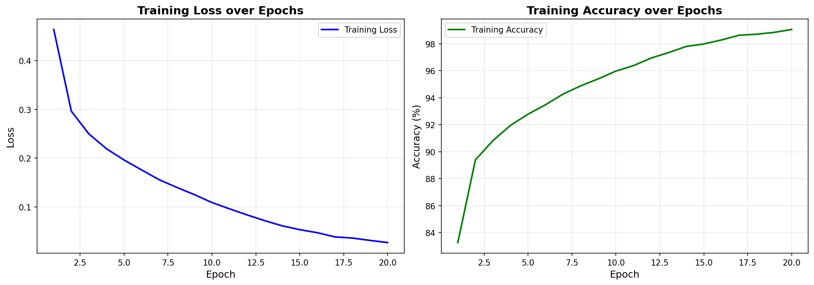
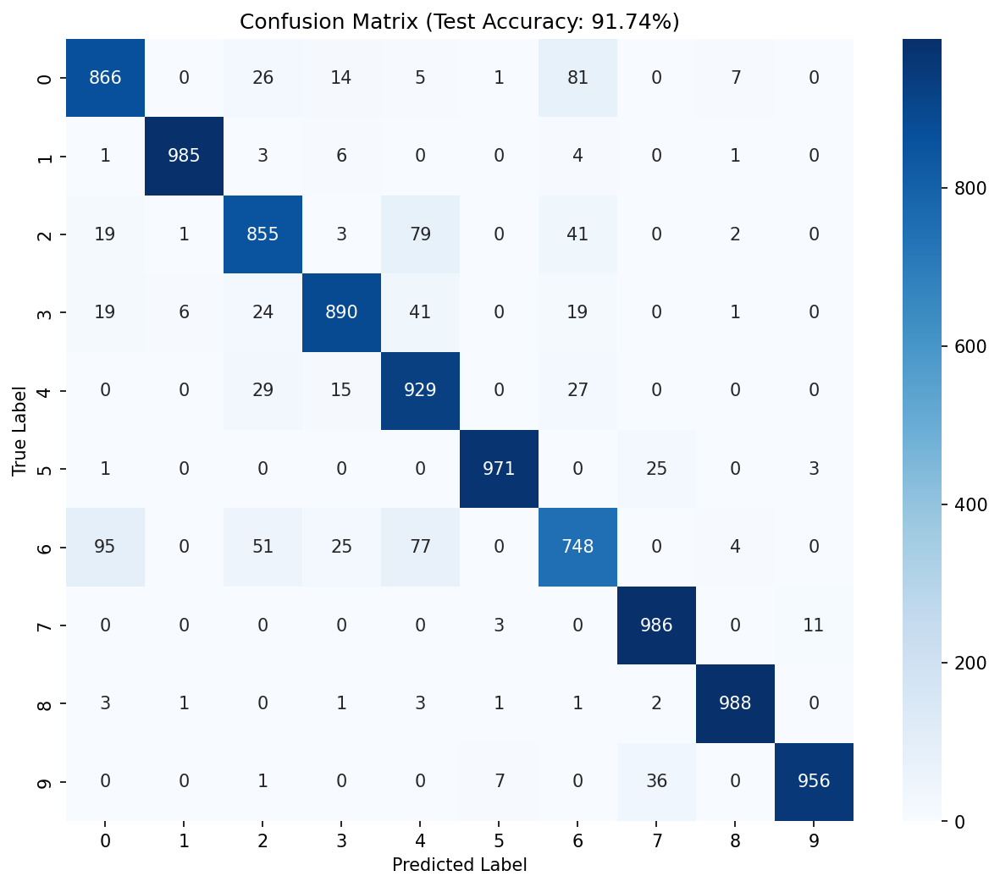

# Fashion-MNIST 이미지 분류

## 1. 프로젝트 개요 (Identity)

### 목표
Fashion-MNIST 데이터셋을 활용하여 10가지 의류 카테고리를 분류하는 CNN 모델 구축

### 사용 모델 및 평가 지표
| 항목 | 내용 |
|------|------|
| 모델 | CNN (Convolutional Neural Network) |
| 프레임워크 | PyTorch |
| 평가 지표 | Accuracy, Confusion Matrix |
| 최종 정확도 | **91.84%** |

### 핵심 요약
- 2개의 합성곱 블록(Conv → ReLU → MaxPool)과 2개의 완전연결층으로 구성된 CNN 모델 설계
- 단순 MLP 대비 CNN의 공간적 특징 추출 능력이 의류 이미지 분류에 효과적임을 확인

---

## 2. 비즈니스 인사이트 및 가설 검증 (Impact)

### 클래스별 분류 난이도 분석
오차 행렬 분석 결과, 특정 클래스 간 혼동 패턴 발견:

| 혼동 패턴 | 원인 분석 |
|-----------|-----------|
| Shirt ↔ T-shirt/top | 형태적 유사성 (상의류 간 구분 어려움) |
| Pullover ↔ Coat | 긴 소매와 유사한 실루엣 |
| Sneaker ↔ Ankle boot | 신발류 간 형태 유사성 |

### 실제 적용 시사점
- **패션 이커머스**: 자동 상품 카테고리 분류 시스템에 활용 가능
- **재고 관리**: 의류 종류별 자동 분류로 물류 효율화
- **한계점**: 상의류 간 세부 분류는 추가적인 특징(색상, 패턴, 소재 등) 정보가 필요

---

## 3. 분석 파이프라인 (Process)

### 3.1 데이터 로드
```
훈련 데이터: 60,000개 이미지
테스트 데이터: 10,000개 이미지
이미지 크기: 28 × 28 픽셀 (흑백)
```

바이너리 파일(.idx3-ubyte) 형식으로 저장된 데이터를 NumPy로 직접 로드
- 이미지 파일: 16바이트 헤더 스킵 후 읽기
- 라벨 파일: 8바이트 헤더 스킵 후 읽기

### 3.2 데이터 전처리

| 단계 | 처리 내용 | 이유 |
|------|-----------|------|
| 정규화 | 0~255 → 0~1 (float32) | 학습 안정성 및 수렴 속도 향상 |
| 채널 추가 | (N, 28, 28) → (N, 1, 28, 28) | PyTorch Conv2d 입력 형식 맞춤 (NCHW) |

### 3.3 데이터 클래스
```
0: T-shirt/top  1: Trouser     2: Pullover   3: Dress      4: Coat
5: Sandal       6: Shirt       7: Sneaker    8: Bag        9: Ankle boot
```

---

## 4. 모델링 및 성능 평가 (Technical)

### 4.1 모델 아키텍처

```
Input (1, 28, 28)
    ↓
Conv2d(1→32, 3×3, padding=1) → ReLU → MaxPool(2×2)
    ↓ (32, 14, 14)
Conv2d(32→64, 3×3, padding=1) → ReLU → MaxPool(2×2)
    ↓ (64, 7, 7)
Flatten → (3136)
    ↓
Linear(3136→128) → ReLU
    ↓
Linear(128→10)
    ↓
Output (10 classes)
```

### 4.2 모델 선택 이유
| 선택 | 이유 |
|------|------|
| CNN 사용 | 이미지의 공간적 구조(엣지, 형태)를 보존하며 특징 추출 |
| 3×3 커널 | 작은 커널로 세밀한 패턴 감지 + 파라미터 효율성 |
| MaxPooling | 위치 불변성 확보 및 연산량 감소 |
| 2개 Conv 블록 | 저수준(엣지) → 고수준(형태) 특징 계층적 학습 |

### 4.3 하이퍼파라미터

| 파라미터 | 값 | 선택 근거 |
|----------|-----|-----------|
| Optimizer | Adam | 적응적 학습률로 안정적 수렴 |
| Learning Rate | 0.0008 | 기본값(0.001) 대비 미세 조정으로 과적합 방지 |
| Batch Size | 64 | GPU 메모리 효율과 학습 안정성 균형 |
| Epochs | 20 | 손실 수렴 확인 후 결정 |
| Loss Function | CrossEntropyLoss | 다중 클래스 분류 표준 |

### 4.4 최종 성능

| 지표 | 결과 |
|------|------|
| Test Accuracy | **91.84%** |
| Device | MPS (Apple Silicon GPU) |

#### 학습 곡선


#### 혼동 행렬


---

## 5. 회고 및 개선 방향 (Retrospective)

### 배운 점
1. **CNN의 계층적 특징 학습**: 풀링으로 해상도는 줄지만 채널 증가로 추상화 수준이 높아짐
2. **PyTorch 학습 루프**: forward → loss → backward → step의 명시적 흐름 이해
3. **데이터 형식**: NCHW(배치, 채널, 높이, 너비) 텐서 형식의 중요성

### 기술적 한계점
- 단순 CNN 구조로 91.84% 달성, 추가 개선 여지 존재
- 흑백 이미지로 색상 정보 활용 불가
- 클래스 간 형태 유사성으로 인한 혼동 존재

### 향후 개선 계획
| 방향 | 구체적 방법 |
|------|-------------|
| 모델 고도화 | Dropout, BatchNorm 추가로 과적합 방지 |
| 데이터 증강 | RandomRotation, RandomHorizontalFlip 적용 |
| 아키텍처 개선 | ResNet 스타일 Skip Connection 도입 |
| 앙상블 | 여러 모델 예측 결합으로 성능 향상 |

---

## 디렉토리 구조
```
fashion-mnist/
├── README.md
├── fashion_mnist_cnn.ipynb    # 메인 노트북
├── data/                      # 데이터 파일
│   ├── train-images-idx3-ubyte
│   ├── train-labels-idx1-ubyte
│   ├── t10k-images-idx3-ubyte
│   └── t10k-labels-idx1-ubyte
└── images/                    # 시각화 이미지
```
