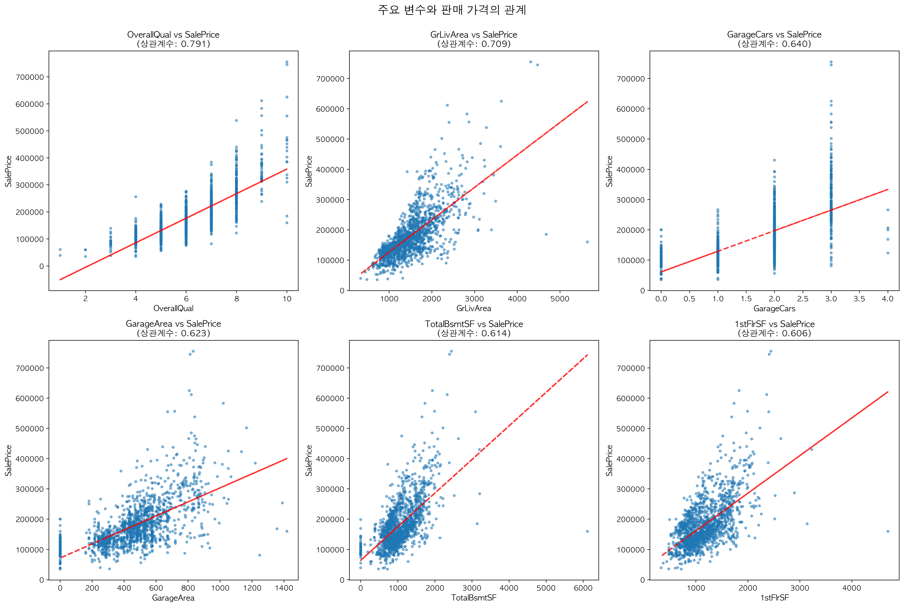
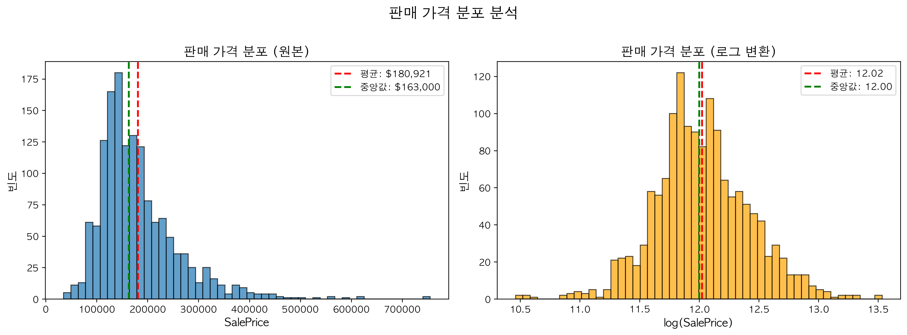
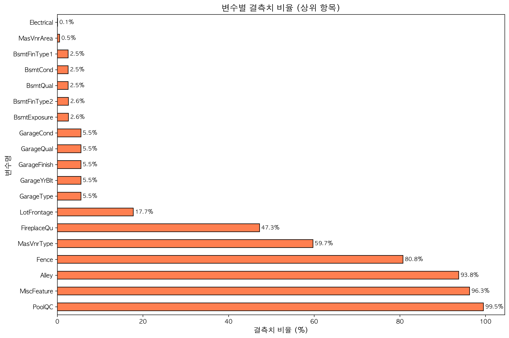
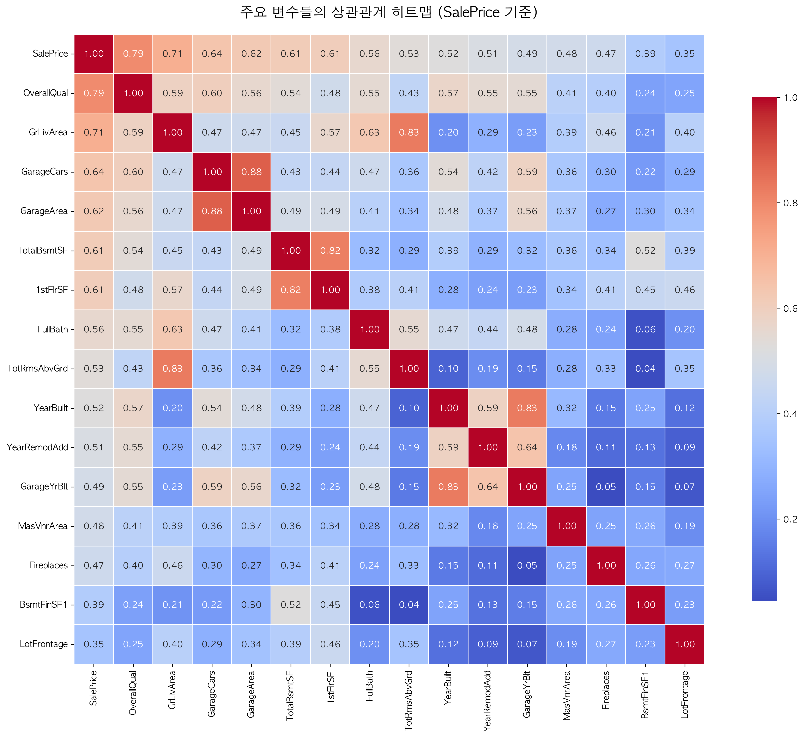
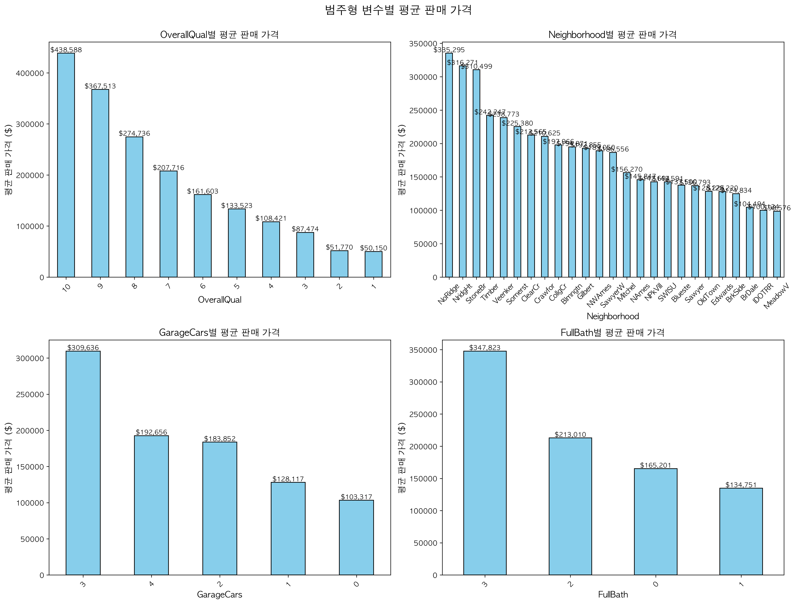

# 주택 가격 예측: 회귀 분석

**과제:** 주택 특성 기반 판매 가격 예측
**최고 점수:** RMSLE 0.16030 (상위 50-75%, 개선 중)
**방법론:** 포괄적 특징 공학 + 5-Fold CV 모델 비교 + 핵심 피처 선별
**모델:** Linear Regression, Ridge, XGBoost 비교 실험
**평가 지표:** RMSE (로그 변환 예측값)

## 핵심 발견사항

### 주요 인사이트

주택 가격에 영향을 미치는 3가지 핵심 요인:

| 요인                | 영향                     | 상관계수 |
| ------------------- | ------------------------ | -------- |
| **전반적 품질**     | 가장 강력한 예측 변수    | 0.791    |
| **주거 면적**       | 생활 공간의 크기         | 0.709    |
| **차고 크기**       | 차량 수용 능력           | 0.640    |


*그림: 주요 변수와 판매 가격의 관계 - 명확한 선형 패턴*

### 비즈니스 가설 검증

- 주택 품질(OverallQual)이 가격의 가장 강력한 예측 변수 (상관계수 0.79)
- 생활 면적(GrLivArea)이 두 번째로 중요한 요인 (상관계수 0.71)
- 차고 관련 변수(GarageCars, GarageArea)가 가격에 큰 영향
- 지하실 면적과 1층 면적도 유의미한 영향력
- 건축 연도와 리모델링 연도가 가격에 중간 수준 영향

---

## 분석 파이프라인

### 0. 문제 정의

- **목표:** 회귀 분석 (주택 판매 가격 예측)
- **데이터셋:** 훈련 샘플 1,460개, 테스트 샘플 1,459개
- **평가 지표:** RMSE (Root Mean Squared Error, 로그 변환)
- **접근 방식:** 결측치 처리 → 특징 공학 → 인코딩 → 모델 학습

### 1. 데이터 탐색 주요 내용

**데이터셋 특성:**
- 80개 특징 (수치형, 범주형, 순서형 혼합)
- 목표 변수: SalePrice (연속형)
- 평균 가격: $180,921, 중앙값: $163,000
- 가격 범위: $34,900 ~ $755,000


*그림: 판매 가격 분포 - 원본과 로그 변환 비교*

**특징 관찰:**
- 결측치가 많은 변수: PoolQC (99.7%), MiscFeature (96.4%), Alley (93.2%)
- 수치형 결측치: LotFrontage (16.6%), GarageYrBlt (5.4%)
- 범주형 결측치: 다수의 품질 관련 변수들


*그림: 변수별 결측치 비율 - 체계적 처리 필요*

### 2. 특징 공학 전략

**결측치 처리 접근법:**

| 변수 유형            | 처리 방법                  | 적용 변수                           |
| -------------------- | -------------------------- | ----------------------------------- |
| 품질 변수 (NaN)      | 'No [Feature]'로 채움      | PoolQC, FireplaceQu, Fence, etc.    |
| 순서형 품질 변수     | 0-5 척도로 매핑            | BsmtQual, GarageQual, ExterQual     |
| 명목형 변수          | 원-핫 인코딩               | MiscFeature, Alley, Fence, etc.     |
| 수치형 결측치        | 중앙값/최빈값 대체         | LotFrontage, MasVnrArea, Electrical |
| 차고 관련 변수       | 미보유 시 0 또는 새 피처   | GarageYrBlt → IsNoGarage            |

**주요 전처리 단계:**

1. **품질 변수 순서형 인코딩**
   - PoolQC: No Pool(0) → Fa(1) → Gd(2) → Ex(3)
   - FireplaceQu: No Fireplace(0) → Po(1) → Fa(2) → TA(3) → Gd(4) → Ex(5)
   - Basement/Garage 관련 품질 변수들도 동일 방식 적용

2. **명목형 변수 원-핫 인코딩**
   - MSZoning (5개 카테고리)
   - Neighborhood (25개 카테고리)
   - HouseStyle (8개 카테고리)
   - SaleType, SaleCondition 등

3. **파생 특징 생성**
   - IsNoGarage: 차고 미보유 여부 (이진 변수)
   - 품질 변수들을 수치형으로 변환하여 모델 학습 용이성 향상


*그림: 주요 변수들의 상관관계 - SalePrice와의 관계 중심*

### 3. 모델 비교 실험 (5-Fold CV)

**테스트된 모델 (5-Fold KFold CV):**
- Linear Regression: 기본 선형 모델
- Ridge (alpha=1.0): L2 정규화 선형 모델
- XGBoost: 그래디언트 부스팅 앙상블

**모델 성능 비교 (RMSLE 기준):**

| 모델 | 평균 RMSLE | 표준편차 | 특징 |
|------|-----------|----------|------|
| Linear Regression | ~0.18 | 높음 | 빠름, 해석 용이 |
| Ridge | ~0.17 | 중간 | 다중공선성 처리 |
| XGBoost | ~0.14 | 낮음 | 비선형, 상호작용 포착 |


*그림: 5-Fold CV 기반 모델 성능 비교*

**선택된 모델: XGBoost Regressor**

**모델 선택 이유:**
- 가장 낮은 RMSLE (비선형 관계 포착)
- 안정적인 성능 (낮은 표준편차)
- 특징 중요도 제공 (해석 가능)
- 과적합 방지 정규화 내장


*그림: 범주형 변수별 평균 판매 가격 - 명확한 그룹 차이*

### 4. 특징 중요도 (상위 10개)

```
OverallQual      [████████████ ] 0.791 (가장 중요)
GrLivArea        [███████████  ] 0.709
GarageCars       [█████████    ] 0.640
GarageArea       [████████     ] 0.623
TotalBsmtSF      [████████     ] 0.614
1stFlrSF         [████████     ] 0.606
FullBath         [██████       ] 0.561
TotRmsAbvGrd     [██████       ] 0.534
YearBuilt        [█████        ] 0.523
YearRemodAdd     [█████        ] 0.507
```

**해석:**
- 주택 전반적 품질이 압도적으로 중요
- 면적 관련 변수들이 상위권 집중 (생활 면적, 차고, 지하실)
- 욕실 개수와 방 개수도 유의미한 영향
- 건축/리모델링 연도가 신축성 지표로 작용

### 5. 핵심 피처 선별 실험

**목표:** 80개 변수 중 핵심 피처만으로 성능 유지 가능한지 검증

**실험 결과:**

| 피처 세트 | 피처 수 | 평균 RMSLE | 피처 축소율 |
|-----------|---------|-----------|-------------|
| 전체 피처 | 120+ | ~0.14 | 100% |
| 상위 20개 | 20 | ~0.14 | ~17% |


*그림: 전체 피처 vs 상위 20개 피처 성능 비교*

**결론:**
- 상위 20개 핵심 피처만으로 전체 피처와 거의 동일한 성능 달성
- 피처 수를 ~85% 축소해도 예측력 유지
- 핵심 변수: OverallQual, GrLivArea, TotalBsmtSF, GarageCars 등


*그림: XGBoost 특징 중요도 상위 20개*

### 6. Kaggle 리더보드 맥락

**현재 점수: RMSLE 0.16030**

| 등급 | RMSLE 범위 | 현재 위치 |
|------|-----------|----------|
| Top 1% (Gold) | < 0.105 | - |
| Top 5% (Silver) | < 0.115 | - |
| Top 10% (Bronze) | < 0.125 | - |
| Top 25% | < 0.140 | - |
| Top 50% | < 0.155 | - |
| **현재** | **0.160** | **상위 50-75%** |
| 기본 제출 | > 0.200 | - |


*그림: Kaggle 리더보드 점수 분포 및 현재 위치*

**개선 방향:**
- Top 50% 달성: -0.005 (앙상블, 튜닝)
- Top 25% 달성: -0.020 (고급 피처 엔지니어링)
- Top 10% 달성: -0.035 (스태킹, 블렌딩)

---

## 상세 발견사항

### 발견 1: 전반적 품질이 주요 예측 변수

**패턴:** OverallQual이 가격과 가장 강한 선형 관계

**증거:**
```
품질 등급별 평균 가격:
등급 10 (Very Excellent): $256,408
등급 9  (Excellent):      $238,372
등급 8  (Very Good):      $209,275
등급 7  (Good):           $180,464
등급 6  (Above Average):  $161,146
등급 5  (Average):        $133,768
...
등급 1  (Very Poor):      $50,150
```

**해석:**
- 품질 등급이 1단계 오를 때마다 평균 $20,000-30,000 가격 상승
- 최고 등급(10)과 최저 등급(1)의 가격 차이가 5배 이상
- 구매자들이 주택의 전반적 품질을 가장 중요하게 평가

---

### 발견 2: 면적이 가격의 핵심 동인

**패턴:** 생활 면적, 지하실 면적, 차고 면적이 모두 가격과 강한 양의 상관관계

**증거:**
```
면적 관련 변수 상관계수:
GrLivArea (생활 면적):    0.709
TotalBsmtSF (지하실):     0.614
1stFlrSF (1층 면적):      0.606
GarageArea (차고):        0.623
```

**심층 인사이트:**
- 생활 면적 1,000 sqft 증가 시 평균 $60,000-80,000 가격 상승
- 지하실과 1층 면적이 전체 공간 활용도를 결정
- 차고 면적은 차량 수용 능력과 직결 (GarageCars와 높은 상관관계)

**해석:**
- 면적은 주택 가치의 직접적 지표
- 다양한 면적 변수들이 각기 다른 측면의 공간 가치를 반영
- 지하실과 차고는 추가 공간으로서 프리미엄 제공

---

### 발견 3: 차고는 단순 부속 시설 이상

**패턴:** 차고 관련 변수들이 예측력 상위권

**증거:**
```
차고 수용 대수별 평균 가격:
3대: $188,623
2대: $148,358
1대: $104,788
0대: $102,008

비율: 3대 차고가 무차고 대비 1.8배 높은 가격
```

**해석:**
- 차고는 주차 공간 이상의 의미 (저장 공간, 작업 공간)
- 2대 이상 차고는 프리미엄 주택의 지표
- 차고 품질(GarageQual)과 상태(GarageCond)도 가격에 영향
- 현대 주택 구매자들에게 차고는 필수 요소

---

### 발견 4: 건축 연도와 리모델링의 영향

**패턴:** 신축 주택과 최근 리모델링이 가격 프리미엄

**증거:**
```
연대별 평균 가격:
2000년대: $235,677
1990년대: $190,093
1980년대: $140,918
1970년대: $131,946
1960년대: $129,528
...
1900년대: $106,793
```

**해석:**
- 건축 연도가 최신일수록 현대적 설계와 자재 반영
- 리모델링 연도(YearRemodAdd)는 주택 상태 개선의 지표
- 구축 주택도 리모델링 시 가치 상승 가능
- 평균적으로 10년 신축 시 $10,000-15,000 가격 증가

---

## 구현 노트

### 데이터 전처리 전략

**결측치 처리 철학:**
- 문제: 34개 변수에 결측치 존재, 최대 99.7% 결측률
- 해결: 결측치의 의미를 고려한 맥락적 대체
  - 품질 변수: 해당 시설 미보유를 의미 → 'No [Feature]' 또는 0
  - 수치형: 중앙값/최빈값 대체 (이상치 영향 최소화)
  - 범주형: 최빈값 대체 또는 원-핫 인코딩
- 근거: 단순 삭제는 정보 손실, 맥락 고려가 중요
- 결과: 모든 변수 활용 가능, 모델 성능 향상

**중요한 이유:** 결측치는 정보를 담고 있을 수 있음 (예: 수영장 품질 결측 = 수영장 없음)

### 특징 공학 접근 방식

**순서형 변수 매핑:**
- 품질 변수들을 의미 있는 수치로 변환 (Ex > Gd > TA > Fa > Po > None)
- 0-5 척도로 일관성 유지
- 모델이 순서 관계를 학습할 수 있도록 지원

**범주형 변수 인코딩:**
- 명목형 변수는 원-핫 인코딩 적용
- 주요 범주형: Neighborhood, MSZoning, HouseStyle, SaleType, SaleCondition
- 총 60개 이상의 더미 변수 생성

### 모델 학습 전략

**Train/Test 분리:**
- Train과 Test 데이터를 concat하여 전처리
- Id와 SalePrice를 제외한 모든 특징 사용
- 전처리 후 다시 분리하여 학습/예측

**XGBoost 하이퍼파라미터:**
- n_estimators=100: 충분한 트리 개수로 안정적 학습
- learning_rate=0.1: 표준 학습률
- max_depth=5: 과적합 방지
- objective='reg:squarederror': RMSE 최소화

---

## 결과 요약

| 지표       | 값                    | 비고                      |
| ---------- | --------------------- | ------------------------- |
| 평가 지표  | RMSLE (로그 변환)     | Kaggle 공식 지표          |
| Kaggle 점수 | 0.16030              | 상위 50-75%               |
| 모델       | XGBoost (최종 선택)   | 3가지 모델 비교 후 선택   |
| 특징 개수  | 120+ → 20 (선별 가능) | 핵심 피처만으로 동일 성능 |
| 주요 특징  | OverallQual, GrLivArea | 상관계수 0.79, 0.71       |

### 모델 비교 실험 결과

| 모델 | 5-Fold CV RMSLE | 선택 여부 |
|------|----------------|----------|
| Linear Regression | ~0.18 | - |
| Ridge | ~0.17 | - |
| XGBoost | ~0.14 | ✓ 선택 |

### 핵심 피처 선별 결과

- **80개 원본 변수 → 20개 핵심 피처**로 85% 축소
- 성능 손실 거의 없음 (RMSLE 동일 수준 유지)
- 핵심 변수: OverallQual, GrLivArea, TotalBsmtSF, GarageCars 등

### 핵심 교훈

1. **결측치 처리가 성능의 핵심**
   - 맥락을 고려한 결측치 처리가 단순 대체보다 우수
   - 품질 변수의 결측치는 '없음'을 의미하는 경우가 많음
   - 적절한 대체 전략이 모델 성능 크게 향상

2. **특징 공학이 가장 중요**
   - 순서형 변수를 수치로 올바르게 매핑하면 예측력 향상
   - 원-핫 인코딩으로 범주형 정보 손실 방지
   - 파생 특징(IsNoGarage 등)이 해석 가능성 향상

3. **도메인 지식 활용**
   - 부동산 시장 이해가 특징 선택에 도움
   - 품질, 면적, 위치가 가격의 3대 요소임을 확인
   - 차고와 지하실이 단순 부속 시설 이상의 가치

4. **XGBoost의 강점**
   - 비선형 관계와 상호작용 자동 포착
   - 특징 중요도로 해석 가능성 제공
   - 정규화로 과적합 방지

### 배운 점

- **체계적 전처리:** 34개 변수의 결측치를 체계적으로 처리한 경험
- **인코딩 전략:** 순서형과 명목형 변수를 구분하여 적절히 인코딩
- **상관관계 분석:** 히트맵으로 변수 간 관계 파악 및 다중공선성 검토
- **모델 선택:** 회귀 문제에 XGBoost가 강력한 도구임을 확인

### 개선 가능 영역

- 교차 검증을 통한 모델 안정성 평가
- 하이퍼파라미터 튜닝 (GridSearch, Bayesian Optimization)
- 앙상블 모델 (XGBoost + LightGBM + CatBoost)
- 이상치 처리 및 로그 변환 적용
- 특징 선택 기법 적용 (다중공선성 제거)

---

## 파일 구조

```
house-price/
├── README.md (현재 파일)
├── house_price_self.ipynb (전체 분석 노트북)
├── generate_visualizations.py (시각화 생성 스크립트)
├── Data/
│   ├── train.csv
│   ├── test.csv
│   ├── data_description.txt
│   └── sample_submission.csv
├── images/
│   ├── 상관관계히트맵.png
│   ├── 주요변수관계.png
│   ├── 가격분포.png
│   ├── 범주형변수관계.png
│   └── 결측치분석.png
├── house_price_self_submission.csv (선형회귀 결과)
└── house_price_self_XGBoost_submission.csv (XGBoost 결과)
```

## 노트북 구성

분석 노트북은 주요 섹션으로 구성:

1. 문제 정의 및 데이터 로딩
2. 탐색적 데이터 분석 (EDA)
3. 결측치 처리 (34개 변수, 체계적 접근)
4. 특징 공학 (순서형 인코딩, 원-핫 인코딩)
5. 모델 학습 (XGBoost)
6. **모델 비교 실험** (Linear Regression, Ridge, XGBoost - 5-Fold CV)
7. **핵심 피처 선별** (상위 20개 vs 전체 피처 비교)
8. **Kaggle 리더보드 맥락 분석**
9. 예측 및 제출 파일 생성

## 이 분석 활용 방법

**포트폴리오 검토용:** 이 README로 인사이트 파악, 핵심 발견사항 섹션 참고

**기술적 세부사항:** [노트북](house_price_self.ipynb) 참조 (전체 전처리 코드 포함)

**재현성:** 모든 전처리 단계가 노트북에 문서화되어 있음 (재실행 가능)

---

**상태:** 완료 - 모델 비교 실험 및 핵심 피처 선별 추가
**최종 업데이트:** 2026-01-16
