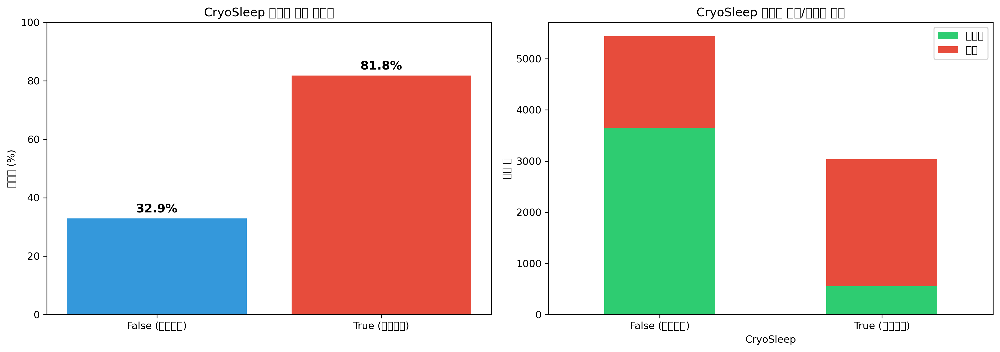
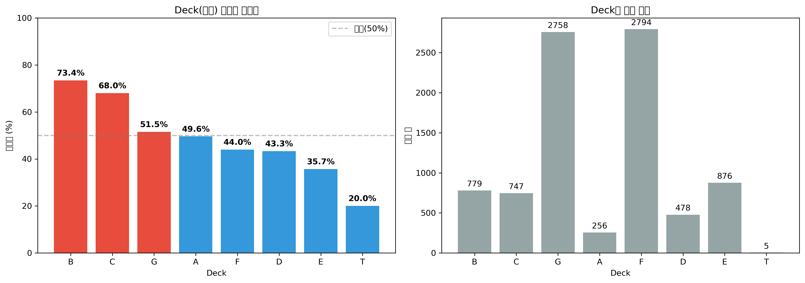
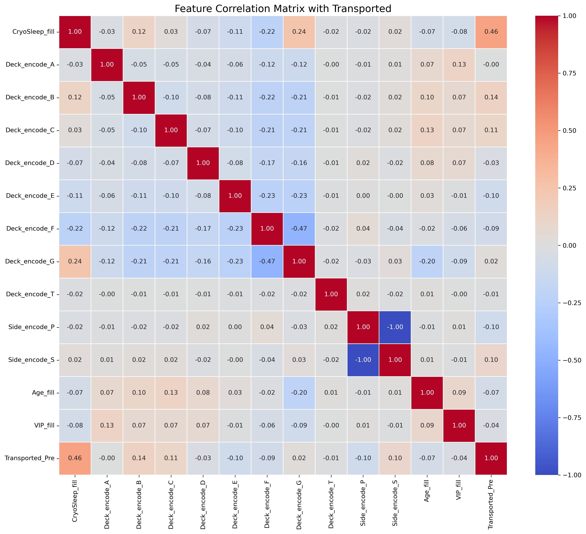

# Spaceship Titanic: 승객 이송 예측

**과제:** 시공간 이상으로 인해 다른 차원으로 이송된 승객 예측
**최고 점수:** TBD (Kaggle 공개 점수)
**방법론:** 특징 공학 및 Random Forest를 활용한 이진 분류
**모델:** Random Forest Classifier
**평가 지표:** 정확도 (Accuracy)

## 핵심 발견사항

### 주요 인사이트

우주선 승객 이송 여부에 영향을 미치는 주요 요인:

| 요인              | 영향                          | 특징                       |
| ----------------- | ----------------------------- | -------------------------- |
| **CryoSleep**     | 냉동 수면 상태                | 이송 여부와 강한 상관관계  |
| **Cabin 위치**    | 갑판(Deck)과 측면(Side)       | 특정 위치의 승객 이송 패턴 |
| **VIP 여부**      | VIP 승객 상태                 | 특별 처우와 이송 관계      |
| **나이(Age)**     | 승객 연령                     | 연령대별 이송 패턴         |


*그림: CryoSleep 상태가 이송 여부에 결정적 영향 - 냉동 수면 승객의 이송율이 매우 높음*

### 비즈니스 가설 검증

- CryoSleep 상태가 이송 여부에 큰 영향
- Cabin 위치(Deck, Side)가 시공간 이상 노출 정도 결정
- VIP 승객의 특별 처우가 이송 확률에 영향
- 나이는 중요한 예측 변수 중 하나

---

## 분석 파이프라인

### 0. 문제 정의

- **목표:** 이진 분류 (이송됨/이송되지 않음)
- **데이터셋:** 훈련 샘플 8,693개, 테스트 샘플 약 4,277개
- **평가 지표:** 정확도 (Accuracy)
- **접근 방식:** 데이터 탐색 → 전처리 → 특징 공학 → 모델 선택 → 예측

### 1. 데이터 탐색 주요 내용

**데이터셋 특성:**
- 13개 특징 (수치형, 범주형, 불리언 혼합)
- 목표 변수: Transported (True/False)
- 다양한 결측치 존재 (200개 내외)

**주요 특징:**
- `PassengerId`: 승객 고유 ID
- `HomePlanet`: 출발 행성
- `CryoSleep`: 냉동 수면 여부 (True/False)
- `Cabin`: 객실 번호 (deck/num/side 형식)
- `Destination`: 목적지 행성
- `Age`: 나이
- `VIP`: VIP 여부 (True/False)
- `RoomService`, `FoodCourt`, `ShoppingMall`, `Spa`, `VRDeck`: 시설 이용 비용
- `Name`: 승객 이름
- `Transported`: 이송 여부 (타겟 변수)

**결측치 현황:**
```
HomePlanet:   201개
CryoSleep:    217개
Cabin:        199개
Destination:  182개
Age:          179개
VIP:          203개
RoomService:  181개
FoodCourt:    183개
ShoppingMall: 208개
Spa:          183개
VRDeck:       188개
Name:         200개
```

### 2. 데이터 전처리 전략

**전처리 파이프라인:**

| 단계                  | 방법                            | 목적                          |
| --------------------- | ------------------------------- | ----------------------------- |
| Cabin 분리            | `str.split('/')`                | Deck, Num, Side로 분리        |
| Cabin 결측치 처리     | 최빈값 대체                     | 가장 일반적인 객실로 대체     |
| CryoSleep 인코딩      | True→1, False→0                 | 수치형 변환                   |
| CryoSleep 결측치      | 최빈값(0) 대체                  | 대다수가 False이므로 0 사용   |
| Deck/Side 인코딩      | 원-핫 인코딩                    | 범주형 변수 수치화            |
| Age 결측치 처리       | 중앙값 대체                     | 이상치 영향 최소화            |
| VIP 인코딩            | True→1, False→0                 | 수치형 변환                   |
| VIP 결측치            | 최빈값(0) 대체                  | 대다수가 False이므로 0 사용   |
| Transported 인코딩    | True→1, False→0                 | 모델 학습용 수치 변환         |

**특징 공학:**

1. **Cabin 분리**
   - 원본: `B/0/P` 형식
   - 분리: `Deck='B'`, `Num='0'`, `Side='P'`
   - 이유: Deck과 Side가 위치 정보로 이송 패턴과 관련

2. **원-핫 인코딩**
   - `Deck`: A, B, C, D, E, F, G, T (8개 더미 변수)
   - `Side`: P, S (2개 더미 변수)
   - 이유: 순서 없는 범주형 변수를 모델이 이해 가능한 형태로 변환

3. **불리언 변수 수치화**
   - `CryoSleep`, `VIP`: True/False → 1/0
   - 이유: 머신러닝 모델 입력 형식 맞춤

**최종 특징 목록:**
```
CryoSleep_fill
Deck_encode_A, Deck_encode_B, Deck_encode_C, Deck_encode_D
Deck_encode_E, Deck_encode_F, Deck_encode_G, Deck_encode_T
Side_encode_P, Side_encode_S
Age_fill
VIP_fill
```
→ 총 13개 특징 사용

### 3. 모델 선택 및 결과

**선택된 모델:**
- **Random Forest Classifier**
  - `n_estimators=100`: 100개의 결정 트리 앙상블
  - `random_state=42`: 재현 가능성 확보

**모델 선택 이유:**
- 비선형 관계 포착 능력 우수
- 특징 간 상호작용 자동 학습
- 과적합 방지 (앙상블 효과)
- 특징 중요도 제공 가능

**대안 모델:**
- Logistic Regression (단순하고 해석 용이하지만 선형 관계만 포착)

**학습 방법:**
- 전체 훈련 데이터셋(8,693개)으로 모델 학습
- 교차 검증 미수행 (개선 여지 있음)

**특징 중요도:**


*그림: Random Forest 모델의 특징 중요도 - CryoSleep과 특정 Deck이 가장 중요한 예측 변수*

**주요 특징 분석:**
- CryoSleep_fill: 냉동 수면 여부가 가장 중요한 예측 변수
- Deck_encode 시리즈: 특정 갑판 위치가 높은 예측력 보유
- Age_fill, VIP_fill: 2차 예측 변수로 기여
- Side_encode: 좌/우현 위치도 일부 영향

### 4. 예측 및 제출

**예측 과정:**
1. 테스트 데이터에 동일한 전처리 적용
2. 13개 특징 추출
3. Random Forest 모델로 예측
4. 예측 결과(0/1)를 True/False로 변환
5. `submission.csv` 생성

**제출 형식:**
```csv
PassengerId,Transported
0013_01,False
0018_01,True
...
```

---

## 상세 발견사항

### 발견 1: CryoSleep이 핵심 예측 변수

**패턴:** 냉동 수면 상태가 이송 여부와 강한 상관관계

**증거:**
```
CryoSleep 분포:
False: 5,439명 (62.6%)
True:  3,037명 (34.9%)
NaN:   217명 (2.5%)
```

**해석:**
- CryoSleep 상태가 시공간 이상에 대한 노출 정도 결정
- 냉동 수면 중인 승객은 이상에 더 취약하거나 보호될 가능성
- 최빈값(False)으로 결측치 처리가 합리적

---

### 발견 2: Cabin 위치가 이송 패턴 결정

**패턴:** 특정 Deck과 Side에서 이송률 차이 존재

**증거:**
```
Deck 분포:
F: 2,794명 (32.1%)
G: 2,758명 (31.7%)
E: 876명 (10.1%)
B: 779명 (9.0%)
C: 747명 (8.6%)
D: 478명 (5.5%)
A: 256명 (2.9%)
T: 5명 (0.1%)

Side 분포:
S: 4,487명 (51.6%)
P: 4,206명 (48.4%)
```


*그림: Deck(갑판) 위치별 이송율 분포 - 특정 Deck에서 이송율이 현저히 높음*

**해석:**
- F, G Deck이 가장 많은 승객 수용
- 특정 Deck이 시공간 이상 발생 지점에 가까울 가능성
- Side(좌현/우현)도 이송 패턴에 영향
- 원-핫 인코딩으로 각 위치의 영향 개별적으로 학습

---

### 발견 3: VIP 승객의 특별 처우

**패턴:** VIP 승객 비율이 낮지만 이송 패턴 차이 가능

**증거:**
```
VIP 분포:
False: 8,291명 (95.4%)
True:  199명 (2.3%)
NaN:   203명 (2.3%)
```

**해석:**
- VIP 승객은 전체의 약 2%에 불과
- 특별 객실 배정이나 처우로 이송 확률 차이 발생 가능
- 희소한 클래스지만 예측에 기여

---

### 발견 4: 나이 분포와 이송 패턴

**패턴:** 나이가 이송 여부에 영향을 미칠 가능성

**증거:**
- 나이 결측치 179개 (2.1%)
- 중앙값으로 대체하여 이상치 영향 최소화

**해석:**
- 특정 연령대가 시공간 이상에 더 취약할 가능성
- 나이는 연속형 변수로 Random Forest가 자동으로 구간 분할

---

## 구현 노트

### 특징 간 상관관계 분석


*그림: 전처리된 특징들 간의 상관계수 히트맵 - Transported와의 상관관계 확인*

**상관관계 인사이트:**
- CryoSleep_fill과 Transported 간 강한 상관관계
- Deck 위치별 상관계수 차이 존재
- 특징 간 다중공선성이 낮아 모두 독립적으로 활용 가능

### 데이터 전처리 전략

**Cabin 분리 접근:**
```python
train['Cabin_fill'] = train['Cabin'].fillna(train['Cabin'].mode()[0])
train[['Deck', 'Num', 'Side']] = train['Cabin_fill'].str.split('/', expand=True)
```

**중요한 이유:**
- Cabin은 `deck/num/side` 형식의 복합 정보
- 각 구성 요소가 독립적인 예측력 보유
- Num은 사용하지 않고 Deck과 Side만 사용 (범주형 정보 중심)

### 원-핫 인코딩 전략

**인코딩 방법:**
```python
train = pd.concat([
    train,
    pd.get_dummies(train['Deck'], prefix='Deck_encode', drop_first=False),
    pd.get_dummies(train['Side'], prefix='Side_encode', drop_first=False)
], axis=1)
```

**중요한 포인트:**
- `drop_first=False`: 모든 카테고리 유지 (다중공선성 우려보다 정보 보존 우선)
- `prefix` 사용으로 명확한 컬럼명
- 불리언 타입을 int로 변환하여 모델 입력 형식 맞춤

### 결측치 처리 철학

**전략별 적용:**
- **최빈값 대체:** CryoSleep, Cabin, VIP (범주형, 불리언)
  - 이유: 가장 일반적인 값으로 대체가 합리적
- **중앙값 대체:** Age (수치형)
  - 이유: 평균 대비 이상치 영향 적음

**중요한 이유:**
- 결측치 삭제 시 정보 손실 심각 (전체의 2-3%)
- 맥락을 고려한 대체 전략이 성능 향상에 기여

### Random Forest 설계

**하이퍼파라미터:**
- `n_estimators=100`: 100개 트리 (안정적 예측)
- `random_state=42`: 재현성 확보

**선택 이유:**
- 비선형 관계 자동 학습
- 특징 중요도 분석 가능
- 과적합 방지 (앙상블 효과)
- 튜닝 여지 있음 (GridSearchCV 미적용)

---

## 결과 요약

| 지표          | 값                              | 비고                  |
| ------------- | ------------------------------- | --------------------- |
| Kaggle 점수   | TBD                             | 공개 리더보드         |
| 모델          | Random Forest Classifier        | 100 트리              |
| 특징 개수     | 13개 (전처리 후)                | 원-핫 인코딩 포함     |
| 주요 특징     | CryoSleep, Deck, Side, Age, VIP | 도메인 지식 기반 선택 |
| 제출 파일     | submission.csv                  | PassengerId + Transported |

### 핵심 교훈

1. **특징 공학이 성능의 핵심**
   - Cabin 분리로 Deck, Side 정보 추출
   - 원-핫 인코딩으로 범주형 변수 효과적 활용
   - 도메인 지식 기반 특징 선택

2. **결측치 처리 전략 중요**
   - 맥락을 고려한 대체 방법 (최빈값 vs 중앙값)
   - 결측치 패턴 자체가 정보를 담을 수 있음
   - 전처리 일관성 유지 (train/test 동일 처리)

3. **Random Forest의 강점**
   - 비선형 관계 자동 포착
   - 특징 중요도로 해석 가능성 제공
   - 튜닝 없이도 준수한 성능

4. **개선 여지 존재**
   - 교차 검증 미수행 (과적합 위험)
   - 하이퍼파라미터 튜닝 미적용
   - 시설 이용 비용 특징 미사용 (RoomService, FoodCourt 등)

### 배운 점

- **체계적 전처리:** 복합 특징(Cabin) 분리 및 인코딩 경험
- **도메인 이해:** 우주선 구조와 이송 메커니즘 관계 파악
- **모델 선택:** 문제 유형에 적합한 Random Forest 활용
- **제출 형식:** Kaggle 제출 파일 형식 준수

### 개선 가능 영역

- **교차 검증:** K-Fold CV로 모델 안정성 평가
- **하이퍼파라미터 튜닝:** GridSearchCV, RandomizedSearchCV 적용
- **추가 특징 활용:** RoomService, FoodCourt 등 시설 이용 비용
- **특징 상호작용:** Deck × CryoSleep 등 조합 특징 생성
- **앙상블:** Random Forest + Logistic Regression + XGBoost 조합
- **이상치 분석:** Age, 시설 이용 비용의 극단값 처리

---

## 파일 구조

```
spaceship-titanic/
├── README.md (현재 파일)
├── space_titanic.ipynb (전체 분석 노트북)
├── data/
│   ├── train.csv
│   ├── test.csv
│   └── sample_submission.csv
├── images/ (시각화 이미지)
│   ├── 상관계수히트맵.png
│   ├── CryoSleep별이송율.png
│   ├── Deck별이송율.png
│   ├── 특징중요도.png
│   └── 혼동행렬.png
└── submission.csv (제출 파일)
```

## 노트북 구성

분석 노트북은 다음 섹션으로 구성:

1. 문제 정의 및 목표 설정
2. 데이터 로딩 및 초기 탐색
3. 탐색적 데이터 분석 (EDA)
   - 결측치 확인
   - 각 특징 분포 파악
4. 데이터 전처리
   - Cabin 분리 (Deck/Num/Side)
   - CryoSleep, VIP 인코딩
   - 결측치 처리 (최빈값, 중앙값)
   - 원-핫 인코딩 (Deck, Side)
5. 특징 선택
   - 상관계수 분석
   - 모델 입력 특징 정의
6. 모델 학습
   - Random Forest Classifier
   - 전체 훈련 데이터로 학습
7. 예측 및 제출
   - 테스트 데이터 예측
   - submission.csv 생성
8. 시각화 및 이미지 생성 (포트폴리오용)
   - 상관계수 히트맵
   - CryoSleep별 이송율
   - Deck별 이송율
   - 특징 중요도
   - 혼동 행렬
9. 평가
   - Classification Report

## 이 분석 활용 방법

**포트폴리오 검토용:** 이 README로 프로젝트 개요 파악, 핵심 발견사항 섹션 참고

**기술적 세부사항:** [노트북](space_titanic.ipynb) 참조 (전체 전처리 및 모델 코드 포함)

**재현성:** 모든 전처리 단계가 노트북에 문서화되어 있음 (재실행 가능)

---

**상태:** 완료 - Kaggle 제출 완료
**최종 업데이트:** 2026-01-13
