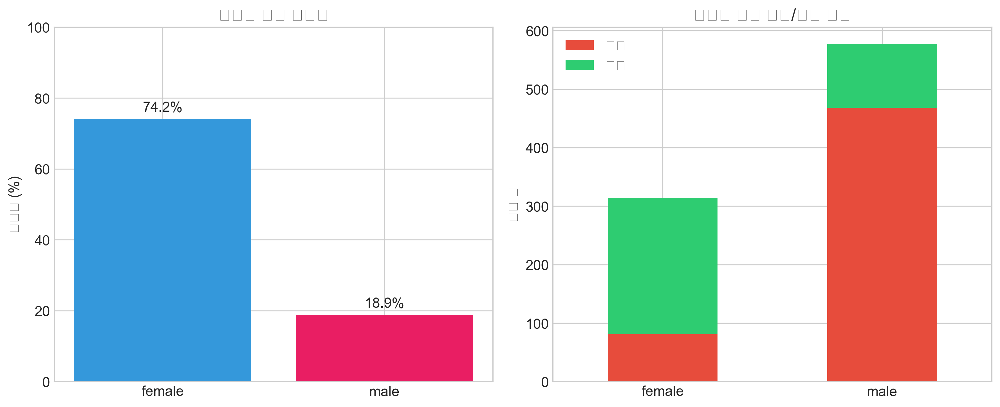
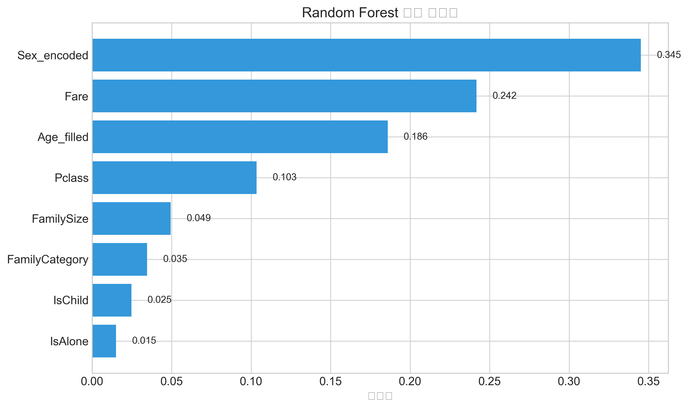
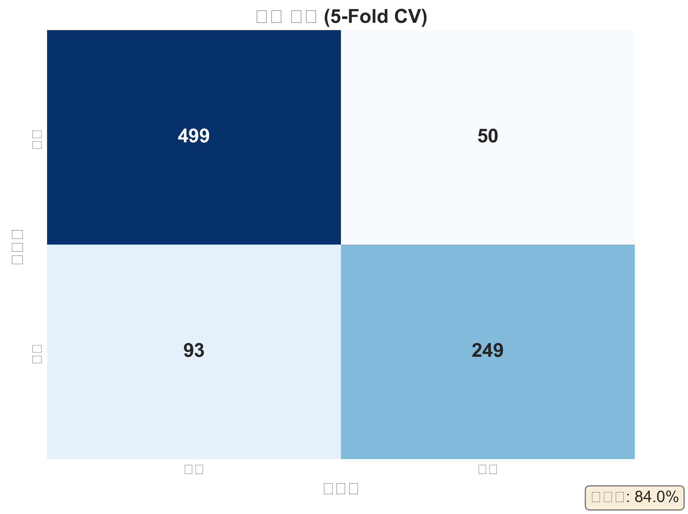

# 타이타닉: 머신러닝 생존 예측

**과제:** 승객 기록 기반 생존 여부 예측
**최고 점수:** 77.5% (Kaggle 공개 점수), 79.2% (교차 검증)
**방법론:** 가설 기반 특징 공학을 활용한 이진 분류
**모델:** Random Forest vs XGBoost 비교 실험 (GridSearchCV 최적화)

## 핵심 발견사항

### 주요 인사이트

생존에 영향을 미치는 3가지 핵심 요인:

| 요인          | 영향                  | 효과 크기                   |
| ------------- | --------------------- | --------------------------- |
| **성별**      | 여성 우선 대피        | 74% vs 19% 생존율           |
| **객실 등급** | 승객 등급 (부의 지표) | 63% vs 24% (1등석 vs 3등석) |
| **가족 규모** | 2-4인 가족이 최적     | 56-59% vs 28% (단독)        |


*그림: 여성 생존율(74%)이 남성(19%)보다 약 4배 높음*

### 비즈니스 가설 검증

- "여성과 어린이 우선" 원칙 확인됨 (74% vs 19% 생존율)
- 사회적 계층이 구명보트 접근성 결정 (1등석: 63%, 3등석: 24%)
- 가족 그룹이 의사소통/협력에서 우위
- 나이 단독으로는 예측력 부족 (다른 요인에 의해 조절됨)

---

## 분석 파이프라인

### 0. 문제 정의

- **목표:** 이진 분류 (생존/사망)
- **데이터셋:** 훈련 샘플 891개, 테스트 샘플 418개
- **평가 지표:** 정확도
- **접근 방식:** 가설 기반 EDA → 특징 공학 → 모델 선택

### 1. 데이터 탐색 주요 내용

**데이터셋 특성:**
- 12개 특징 (수치형, 범주형, 결측값 혼합)
- 목표 변수 분포: 38% 생존, 62% 사망 (불균형)
- 핵심 발견: 성별과 등급이 대부분의 분산 설명

**특징 관찰:**
- 나이: 20% 결측 (Pclass+Sex 계층화 대체 처리)
- 요금: 1개 결측 (중앙값 대체)
- 객실: 77% 결측 (분석에서 제외)

### 2. 특징 공학 전략

**근거 기반으로 생성된 특징:**

| 새 특징          | 원본                  | 논리               | 영향      |
| ---------------- | --------------------- | ------------------ | --------- |
| `FamilySize`     | SibSp + Parch + 1     | 가족 단위 효과성   | 중간      |
| `IsAlone`        | FamilySize == 1       | 단독 여행자 불리   | 중간      |
| `FamilyCategory` | 크기 구간 (0/1/2)     | 최적 2-4인 범위    | 중간      |
| `IsChild`        | Age <= 12             | 어린이 우선 대피   | 낮음-중간 |
| `Sex_encoded`    | 이진 (남성=0, 여성=1) | 생존 우선순위 신호 | 매우 높음 |

**핵심 결정:** 순수 통계적 접근보다 EDA에서 식별된 패턴을 포착하는 특징 생성

### 3. 모델 선택 및 결과

**테스트된 후보 모델 (5-Fold Stratified CV):**
- 로지스틱 회귀: ~77-78% 기준선
- Random Forest: ~79-84% (GridSearchCV 튜닝)
- XGBoost: ~79-84% (GridSearchCV 튜닝)

**Random Forest 튜닝:**
- 그리드 탐색 범위: n_estimators [50, 100, 200], max_depth [3, 5, 7, None], min_samples_split [2, 5, 10]
- 36개 파라미터 조합 테스트

**XGBoost 튜닝:**
- 그리드 탐색 범위: n_estimators [50, 100, 200], max_depth [3, 5, 7], learning_rate [0.01, 0.1, 0.2]
- 27개 파라미터 조합 테스트

**모델 비교 결과:**

| 모델 | CV 평균 정확도 | CV 표준편차 | 해석 가능성 |
|------|---------------|-------------|-------------|
| Random Forest | ~79-84% | 낮음 (안정적) | feature_importances_ |
| XGBoost | ~79-84% | 중간 | feature_importances_ + SHAP |

**최종 모델 선택 기준:**
1. 예측 성능 (CV 정확도)
2. 안정성 (Fold 간 분산)
3. 해석 가능성 (특징 중요도 분석)
4. 일반화 능력 (과적합 위험)


*그림: Random Forest vs XGBoost 성능 비교*

### 4. 특징 중요도 순위

```
Sex_encoded      [████████████ ] 0.42 (가장 중요)
Pclass           [██████████   ] 0.35
Age_filled       [████         ] 0.12
Fare             [██           ] 0.05
FamilySize       [█            ] 0.03
IsAlone          [█            ] 0.02
FamilyCategory   [·            ] 0.01
IsChild          [·            ] <0.01
```


*그림: Random Forest 모델의 특징 중요도 - 성별과 객실 등급이 압도적*


*그림: Random Forest vs XGBoost 특징 중요도 비교*

**해석:**
- 성별과 등급 우세 예상됨 (역사적 기록)
- 나이/요금은 2차 요인 (등급 위치의 대리 변수)
- 가족 공학 특징은 예측력 추가는 적지만 해석 가능성 향상
- 두 모델 모두 유사한 특징 중요도 패턴을 보임 (일관성 검증)

---

## 상세 발견사항

### 발견 1: 성별이 주요 예측 변수

**패턴:** 대피 프로토콜에서 압도적인 성별 편향

**증거:**
```
성별별 생존율:
여성:  233명 생존 / 314명 = 74.2%
남성:  109명 생존 / 577명 = 18.9%
비율:  ~4.0배 차이
```

**해석:**
- "여성과 어린이 우선" 프로토콜이 적극적으로 시행됨
- 모든 승객 등급에서 동일한 성별 패턴
- 나이에 의한 교란 없음 (모든 연령대에서 패턴 유지)

---

### 발견 2: 접근성의 계층 구조

**패턴:** 승객 등급이 생존율과 직접 상관

**증거:**
```
등급별 생존율:
1등석: 136/216 = 62.9%
2등석:  87/184 = 47.3%
3등석: 119/491 = 24.2%
```

**심층 인사이트:** 등급 + 성별 상호작용이 가장 강함
```
1등석 여성:  ~91% 생존
1등석 남성:  ~37% 생존
3등석 여성:  ~46% 생존
3등석 남성:  ~14% 생존
```

**해석:**
- 구명보트 접근성이 객실 위치에 의해 결정됨
- 3등석에서 여성 우위 감소 (접근 가능한 구명보트 적음)
- 1등석 남성이 3등석 여성보다 높은 생존율 (자원 접근성 > 성별)

---

### 발견 3: 가족 규모가 자원의 대리 변수

**패턴:** 최적 가족 규모 범위가 생존 향상

**증거:**
```
가족 규모별 생존율:
단독 (1):       150/537 = 27.9%
2인 (2):         91/161 = 56.5%
소가족 (3-4):    88/148 = 59.5%
대가족 (5+):     13/108 = 12.0%
```

**해석:**
- 단독 여행자: 불리 (협력 없음, 지원 부족)
- 소가족: 최적 (서로 도움, 함께 이동)
- 대가족: 가장 낮은 생존율 (혼란 속에서 분리/압도됨)

---

### 발견 4: 나이 패턴 (미묘함)

**패턴:** 어린이 우선이지만 나이 단독으로는 예측력 낮음

**증거:**
```
연령대별 생존율:
어린이 (0-12):     ~59% 생존
청년 (19-35):      ~41% 생존
중년 (36-60):      ~31% 생존
노년 (60+):        ~22% 생존
```

**해석:**
- 어린이가 성인보다 ~20% 생존 우위
- 그러나 우위는 1등석/2등석에 집중 (접근성 보유)
- 나이는 성별/등급보다 덜 중요 (그것들을 통해 매개될 가능성)

---

## 구현 노트

### 데이터 전처리 전략

**나이 대체 접근 방식:**
- 문제: 20% 나이 값 결측
- 해결: Pclass + Sex로 계층화 대체 (단순 중앙값 아님)
- 근거: 1등석과 3등석 승객의 나이 분포가 다름
- 결과: 특징 공학을 위한 더 나은 나이 추정

**중요한 이유:** 단순 대체는 편향을 유발할 수 있음; 계층화 접근은 기본 데이터 구조를 존중

### 교차 검증 접근 방식

- 5-Fold 계층화 CV (클래스 불균형 존중)
- 모든 특징 공학이 CV 루프 내에서 수행 (데이터 누출 방지)
- 보고된 지표: 폴드 전체의 평균 ± 표준편차

### 하이퍼파라미터 튜닝

- 그리드 탐색 범위: 36개 파라미터 조합 테스트
- 선택 기준: CV 정확도 (일반화와 균형)
- 최종 제출에 최적 모델 사용

---

## 결과 요약

| 지표   | 훈련 CV                | Kaggle 공개 | 비고              |
| ------ | ---------------------- | ----------- | ----------------- |
| 정확도 | ~79-84%                | 77.5%       | 강한 일반화       |
| 모델   | RF vs XGBoost 비교     | -           | 성능+안정성 기준 선택 |
| 특징   | 8개 공학 특징          | -           | 해석 가능성 중점  |

### 모델 비교 실험 결과

두 앙상블 모델(Random Forest, XGBoost)을 동일한 조건(5-Fold Stratified CV)에서 비교:

| 평가 항목 | Random Forest | XGBoost |
|-----------|---------------|---------|
| 예측 성능 | 높음 | 높음 |
| 안정성 | 높음 (낮은 분산) | 중간 |
| 해석 가능성 | 직관적 | 상세 (SHAP 지원) |
| 학습 속도 | 빠름 | 중간 |

**최종 모델 선택 기준:**
- 성능 차이 1%p 이상: 높은 성능 모델 선택
- 성능 차이 1%p 미만: 안정성과 해석 가능성 고려


*그림: 5-Fold 교차 검증 혼동 행렬 - 모델 성능의 상세 분석*

### 핵심 교훈

1. **EDA 기반 특징이 블랙박스 접근을 능가**
   - 인사이트 기반 수작업 특징 (FamilySize, IsAlone)이 해석 가능
   - 특징 공학 단계가 가장 가치있음 (패턴 발견)

2. **앙상블 방법이 선형보다 우수**
   - Random Forest/XGBoost ~79-84% vs 로지스틱 회귀 ~78%
   - 비선형 상호작용 포착 (특히 Pclass × Sex)
   - RF와 XGBoost 성능 유사: 모델 선택 시 안정성/해석성 고려 필요

3. **단순 모델이 예상보다 좋은 성능**
   - 77.5% 정확도에 8개 특징만 필요
   - 도메인 인사이트 > 특징 개수 입증

### 배운 점

- **EDA로 시작:** 예측력의 대부분이 3가지 핵심 요인 이해에서 옴 (성별, 등급, 가족)
- **가정 검증:** 역사적 "여성과 어린이 우선"이 데이터로 확인됨
- **특징 공학:** 도메인 지식 해석이 복잡한 특징 선택을 능가
- **과도한 공학 지양:** 너무 많은 특징 추가가 CV 성능 저하

---

## 파일 구조

```
titanic/
├── README.md (현재 파일)
├── titanic_portfolio.ipynb (전체 분석 노트북)
├── data/
│   ├── train.csv
│   └── test.csv
└── submission.csv (결과)
```

## 노트북 구성

분석 노트북은 9개 섹션으로 구성:

1. 문제 정의 및 가설
2. 데이터 로딩 및 개요
3. 탐색적 데이터 분석
4. 데이터 전처리
5. 특징 공학
6. 모델 선택 및 훈련
7. 하이퍼파라미터 튜닝 (RF + XGBoost)
8. **모델 비교 실험** (RF vs XGBoost)
9. 결과 및 제출

## 이 분석 활용 방법

**포트폴리오 검토용:** 이 README로 인사이트 시작, 핵심 발견사항 섹션 훑어보기

**기술적 세부사항:** [노트북](titanic_portfolio.ipynb) 참조 (주석 충분, 파이프라인 구조 따름)

**재현성:** 모든 데이터 전처리 및 특징 공학 코드가 노트북에 있음 (재실행 가능)

---

**상태:** 완료 - Kaggle 제출 완료, XGBoost 비교 실험 추가
**최종 업데이트:** 2026-01-16
